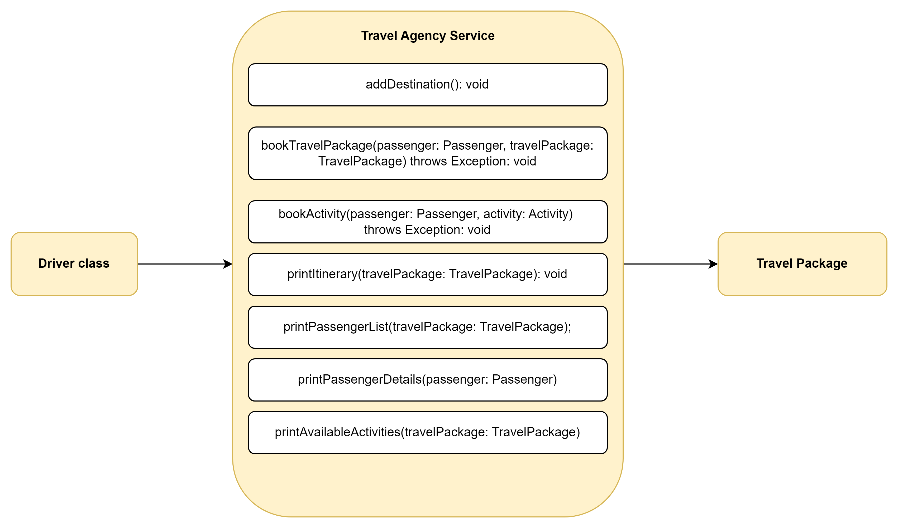
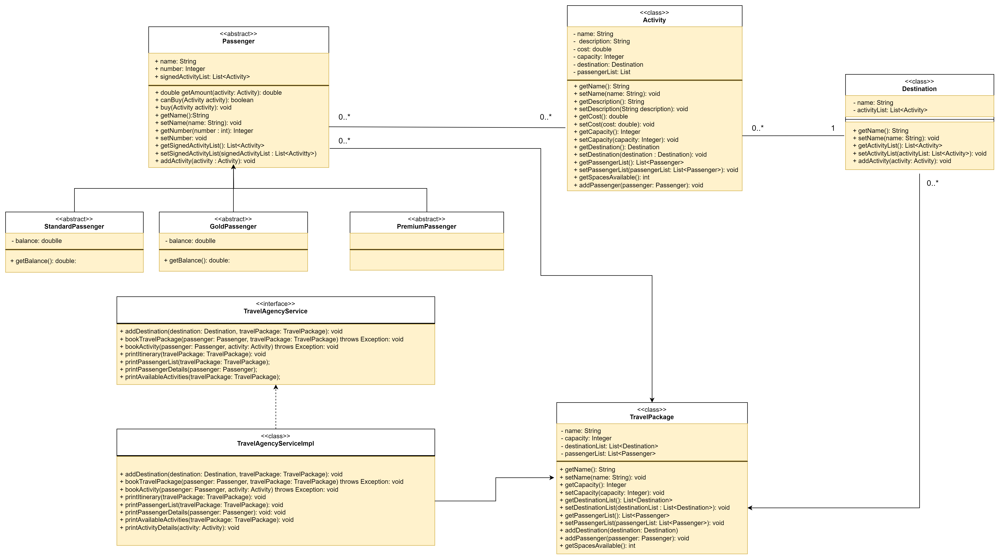
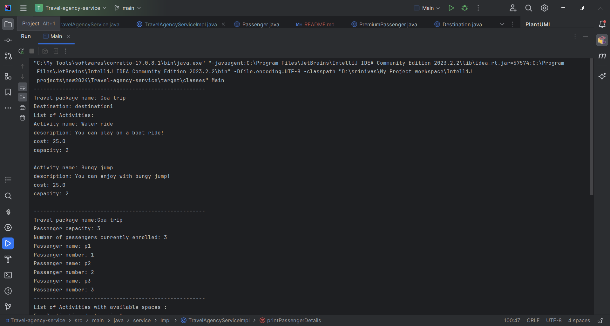
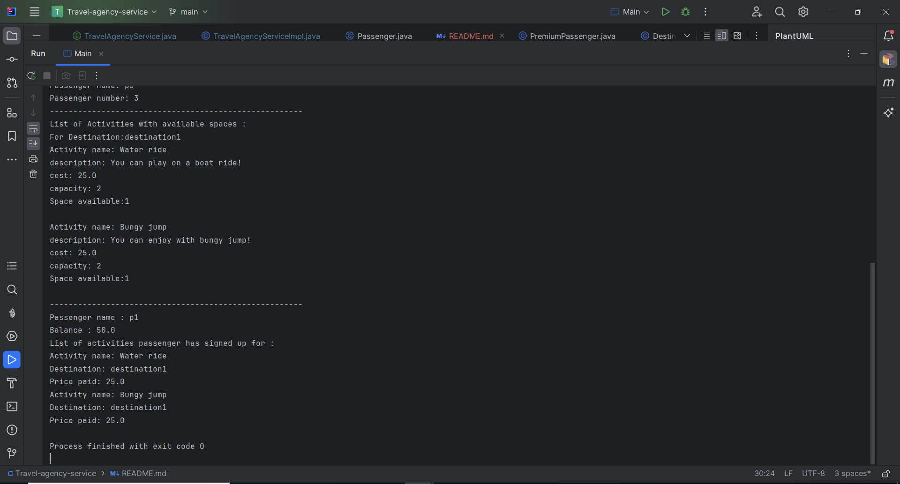

# Travel-agency-service

This Java application has been developed as part of an assignment with the goal of creating software system that allows travel agencies to maintain their travel packages, itinerary and passengers.


## Technologies Used:
- 	Java

## Prerequisites

- Java Development Kit (JDK) 17
- IntelliJ IDEA / Eclipse

## High Level diagram:

 

## Low Level diagram:



## Steps to run the application
1. Clone or download the Spring Boot project from the repository (if not already available).    
   ```bash
   https://github.com/srinivasa8/Travel-agency-service.git
2.	Open the project using an IDE like IntelliJ IDEA, Eclipse, or Spring Tool Suite.
3. Using the terminal or within your IDE, execute mvn clean install to build the project and ensure the build completes successfully without any errors.
4. Locate the Driver class file and Run it to start the application.
5. Once the application runs, Please Check the console output for the output as shown below:
   

   


